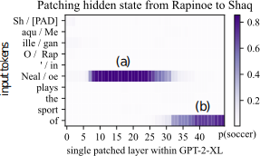
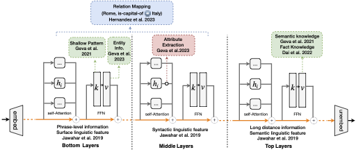
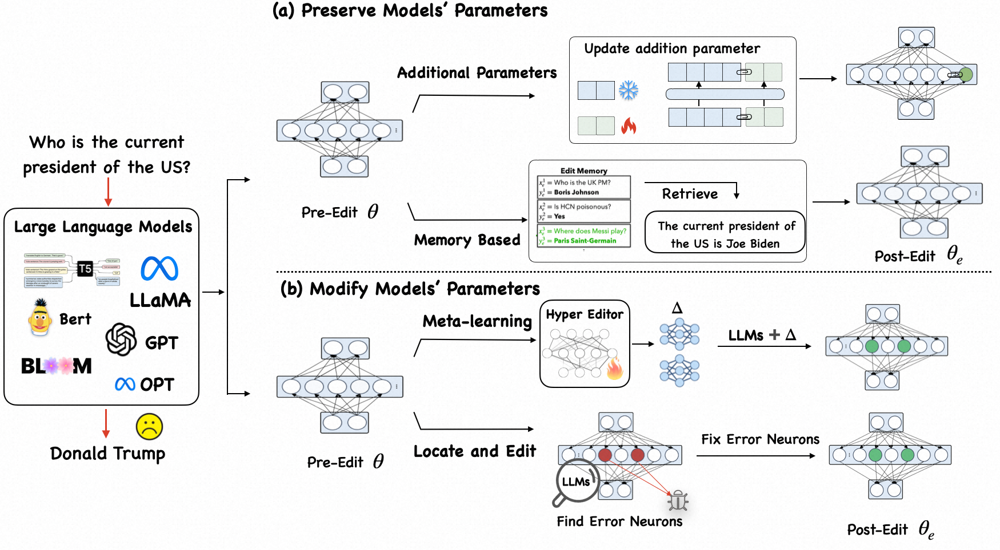

# Knowledge Editing

<!-- Reference: https://github.com/jonschlinkert/markdown-toc -->

<!-- toc -->

- [Proposed Structure](#proposed-structure)
- [Motivation](#motivation)
- [Problem Definition](#problem-definition)
  * [Description](#description)
  * [Definition](#definition)
  * [Task definition](#task-definition)
- [Evaluation for Knowledge Editing](#evaluation-for-knowledge-editing)
  * [Reliability](#reliability)
  * [Generalization](#generalization)
  * [Portability (Robust generalization)](#portability-robust-generalization)
  * [Locality (Specificity)](#locality-specificity)
  * [Other stuff](#other-stuff)
- [Methodology](#methodology)
  * [Mechanism of Knowledge Storage of LLM (Transformer-based)](#mechanism-of-knowledge-storage-of-llm-transformer-based)
  * [Knowledge Editing for LLMs](#knowledge-editing-for-llms)
  * [Expose LLM to New Knowledge During Inference](#expose-llm-to-new-knowledge-during-inference)
    + [Method Type 1](#method-type-1)
  * [Learning Knowledge Through LLM Parameters](#learning-knowledge-through-llm-parameters)
    + [Method Type 2: Utilize additional parameters](#method-type-2-utilize-additional-parameters)
    + [Method Type 3: Meta Learning-based methods](#method-type-3-meta-learning-based-methods)
    + [Method Type 4: Direct edit of intrinsic knowledge (Locating and Editing)](#method-type-4-direct-edit-of-intrinsic-knowledge-locating-and-editing)
  * [Beyond Editing Factual Knowledge](#beyond-editing-factual-knowledge)
- [Future Prospects, Challenges, and Opportunities](#future-prospects-challenges-and-opportunities)
- [Other Stuff](#other-stuff)

<!-- tocstop -->

## Proposed Structure
- Abstract
- Introduction
    - Background info on LLMs & knowledge editing
    - Problems of knowledge editing
    - Organization of the paper
- Motivation
    - Why knowledge editing is important?
    - Why we want to talk about problems of knowledge editing?
- Knowledge editing
    - Brief overview (1-2 paragraph)
    - Definition
        - Problem definition
        - Metrics and Respective Benchmarks
            從 metrics 帶到 benchmark 要探討的東西
    - Introduce current methods and their performance
- Problems of Knowledge Editing
    - Brief overview (1-2 paragraph)
    - Definition and Respective Benchmarks
        Introduce the problems (and the respective benchmarks that aim to find and address those problems)
        - Catastrophic forgetting
        - Ripple effect
        - Bad specificity (locality)
        - Mismatch between success rate and current findings
- Main discussion
    - Brief overview (1-2 paragraph)
    - Problems of current methods (using results from previous benchmarks)
        - Divide the section into multiple parts based on the problems (which method has what kind of problems)
- Limitation & Future Prospects
- Conclusion

## Motivation
- LLM contains unwanted info
    - Bias
    - Misinfo
    - Harmful content (e.g. toxicity, offensive content, privacy issue)
    - Outdated info
- Goal:
    - **Alter** the unwanted info
    - **Maintain** other knowledge
- Why edit?
    - It is too expensive to re-train a LLM

## Problem Definition
### Description
**Change** the LLM's behavior for a given knowledge efficiently **without compromising other cases**

### Definition
- Given a function space $f:\mathbb{X}\rightarrow\mathbb{Y}$ estimated by an initial base model $f_\theta$ and a set of specified edit descriptor $Z_e=\{(x_e,y_e)\}$ s.t. $f_\theta(x_e')\neq y_e'\ \forall (x_e',y_e')\in Z_e$, efficiently create an edited model $f_{\theta_e}$ s.t. $f_{\theta_e}(x_e')=y_e'\ \forall (x_e',y_e')\in Z_e$.
- In addition to the edit descriptor $(x_e,y_e)$ itself, we define two sets that is related to **editing scope**:
    - In-scope samples $I(x_e)$: Includes $x_e$ and its related samples (neighborhood) $N(x_e)$
    - Out-of-scope samples $O(x_e)$: Includes samples that are not related to $x_e$
    - We expect the edited function $f_{\theta_e}$ to behave like the following:

```math
f_{\theta_e}(x)=\begin{cases}y_{\text{updated}} &\text{if }x\in I(x_e) \\
f_{\theta}(x) &\text{if }x\in O(x_e)\end{cases}
```

### Task definition
Usually consists of the following 3 tasks:
- Knowledge insertion: Inserts knowledge that LLMs have not seen before.
- Knowledge modification: Update outdated/incorrect knowledge.
- Knowledge erasure: Erase unwanted knowledge

## Evaluation for Knowledge Editing
### Reliability
- Description: 
    <br> Success rate of editing **based on the edit description** $Z_e$, which is evaluated using the **accuracy** of the post-edit model $f_{\theta_e}$
- Definition:

```math
\mathbb{E}_{(x_e',y_e')\sim Z_e}\mathbb{1}\left\{\mathrm{argmax}_y [p_{\theta_e}(y|x_e')]=y_e'\right\}
```

### Generalization
- Description:
    <br> Success rate (accuracy) within input set containing **in-scope samples** $(x_e',y_e')\sim I_e(x_e)$
- Definition:

```math
\mathbb{E}_{(x_e',y_e')\sim I_e(x_e)}\mathbb{1}\left\{\mathrm{argmax}_y [p_{\theta_e}(y|x_e')]=y_e'\right\}
```

### Portability (Robust generalization)
- Description:
    <br> Success rate of editing when **transferring knowledge to related content** $(x_e',y_e')\sim P_e(x_e)$. Similar to generalization, but is **evaluated on factual reasoning** (one-hop, synonym, subject-replace, reverse-relation, one-to-one relation) not predicted label.
- Definition:

```math
\mathbb{E}_{(x_e',y_e')\sim P_e(x_e)}\mathbb{1}\left\{\mathrm{argmax}_y [f_{\theta_e}(y|x_e')]=y_e'\right\}
```

- Factual reasoning tasks: **WIP ...**
    - One-hop: 
    - Synonym: 
    - Subject-replace: 
    - Reverse-relation: 
    - One-to-one relation: 
    - Multi-hop:
### Locality (Specificity)
- Description:
    <br> Evaluates if model's output **changes only within the editing scope $I_e(x_e)$, without affecting out-of-scope samples $O_e(x_e)$**. Checks if the edited model $f_{\theta_e}$ output remains aligned with the original model $f_{\theta}$.
- Definition:

```math
\mathbb{E}_{(x_e',y_e')\sim O_e(x_e)}\mathbb{1}\left\{p_{\theta_e}(y|x_e')=p_{\theta}(y|x_e')\right\}
```


### Other stuff
- Performance as an LLM: Fluency, robustnes, etc.
- Efficiency: Time/GPU/memory consumption

## Methodology

### Mechanism of Knowledge Storage of LLM (Transformer-based)
- **FFN (MLP)** layers are similar to **Neural Memory Network**.
- **Multi-head self-attention (MHSA)** layers aggregates knowledge from the previous layer through self-attention.
- Knowledge retrieved from FFN at (a), then brought to output token (b) by self-attention
    
    <br> (Reference: https://rome.baulab.info/)
- Steps:
    1. Early (Bottom) MLP layers in the last-subject position encodes many subject-related attirubtes.
    2. MHSA aggregates and propagates the attributes to the prediction position.
    3. Middle layer MHSA in the prediction position queries from previouse layer and extract information.
    4. Top layer MLPs are also associated with semantic/fact kowledge

<br> (Reference: https://arxiv.org/pdf/2401.01286.pdf)

### Knowledge Editing for LLMs
- Requirements:
    - Analyze model behavior
    - Accurately locating the area to edit
    - Design efficient and low-cost methods


(Reference: https://github.com/zjunlp/KnowledgeEditingPapers)

### Expose LLM to New Knowledge During Inference
#### Method Type 1
- [SERAC](https://arxiv.org/abs/2206.06520)
    <br> In addition to the original base model, this method uses an **edit memory storage** (directly stores edit descriptions), a **scope classifier** that determines if the input is related to edit descriptions, and a **Retrieval-Augmented Counterfactual Model** that deals with input samples that are related to edit descriptions.
    - Advantage: Workable with small scope classifier and counterfactual models, doesn't require tuning the original base model. Can handle multiple edits.
    - Disadvantage: Constrained by the edit memory storage (not scalable). In other words, this method is not applicable when there is a large amount of edit descriptions
- [IKE](https://arxiv.org/abs/2305.12740)
    <br> Apply in-context learning to knowledge editing. Uses edit description, in-scope samples, and out-of-scope samples to demonstrate when the model should update its predictions.
    - Advantage: Better locality and generalization. Applicable to many LLMs.
    - Disadvantage: Not applicable to large amount of edit descriptions as the input length of LLMs is limited.
- [MeLLo](https://arxiv.org/abs/2305.14795) (Also the paper that proposed MQuAKE)
    <br> Inspired by SERAC, uses additional memory to store edit descriptions. They make the model decompose the multi-hop questions into sub-questions, generate tentative answers, then iteratively self-check if the answers are consistent with the edit descriptions and correct the answers if not.
    - Advantage: Improved generalization, easy to add/remove edit descriptions.
    - Disadvantage: Similar to SERAC, limited by memory and retrieval accuracy/relevance.
- [DeepEdit](https://arxiv.org/abs/2401.10471)
    <br> Proposed to view knowledge editing as decoding with contraints. They proposed to use a DFS-based progressive decoding method (multi-step reasoning) with information retrieval that can be applied to blackbox LLMs.
    - Proposed constraints:
        - Uniqueness: Ensure each reasoning step introduces new information.
        - Coherence: Ensure the current reasoning step is relevant to the previous step.
        - Awareness: Ensure the current reasoning step does not contradict with edit descriptions. Uses information retrieval to obtain relevant edit descriptions instead of looping through everything to save time.
        - Relevance: Ensures each reasoning step is helpful for finding the final answer. 
    - Advantage: More succinct and faithful reasoning while enforcing the new knowledge. Great quantitative improvement.
    - Disadvantage: *Not sure, but looks like it would cost a lot of time & resource*
### Learning Knowledge Through LLM Parameters
#### Method Type 2: Utilize additional parameters
- [CaliNET](https://arxiv.org/abs/2210.03329)
    <br> Includes two stages: (1) Contrastive Knowledge Assessment (CKA): Detect incorrect factual knowledge stored in LLMs by calculating the ratio of probability of correct knowledge and expected probability of incorrect knowledge; (2) Knowledge Calibration: Introduce extra modules $\Delta \mathrm{FFN}$ that has the same input and output dimension as the original feedforward module $\mathrm{FFN}$. The output of the extra module is directly summed with the output of the original feedforward module ($\mathrm{FFN}'(H)=\mathrm{FFN}(H)+\Delta\mathrm{FFN}(H)$). The latent dimension of $\Delta \mathrm{FFN}$ is typically very small, so the method only introduces a small amount of parameters.
    - Advantage: CKA addresses problems when their are multiple correct answers (superior to rank-based false knowledge detection). The proposed calibration technique preserves the model perplexity and semantic understanding ability.
    - Disadvantage: Edit reliability seems to be inferior to the continue pretraining method. The proposed CKA methodology is somewhat biased as the mismatch in the scope of correct and incorrect knowledge may cause their probability to be incomparible. Locality of the method is not evaluated.
- [T-Patcher](https://arxiv.org/abs/2301.09785)
    <br> For each edit (mistake), add one tunable neuron to the last FFN layer and freeze all other parameters. In addition the original loss, the authors proposed 2 losses  that addresses reliability (by ensuring the predicted value of the extra neuron is not 0 after activation when the input is the edit sample) and locality (minimize the prediction value of the extra neuron when fed with other samples).
    - Advantage: Great performance, light weight.
    - Disadvantage: Computationally expensive.
- [GRACE](https://arxiv.org/abs/2211.11031)
    <br> Adds GRACE adapter to cache the latent space embeddings that correspond to errors/mistakes and explicitly learn what the new embedding should be. It acts like a key-value cache that maps error embeddings to new embeddings. To enhance generalization, an $\epsilon$-ball is introduced so that embeddings that are close enough to the cached embeddings would be substituted with the new learned embedding. An algorithm is proposed to govern how the key-value pair and size of $\epsilon$-ball is updated.
    - Advantage: Great performance compared to existing methods, especially when there are a lot of edits. Preserves model perplexity after tons of edits. Easy to trace and inspect the edits by looking through the cache.
    - Disadvantage: As mentioned in the limitations section, the method might not be able to react to implication questions related to edited knowledge. (Maybe it wouldn't work when it encounters multi-hop questions) Computationally expensive (slow). May require tuning of the initial size of $\epsilon$-balls.
- [MELO](https://arxiv.org/abs/2312.11795)
    <br> Uses dynamic LoRA to learn the edited knowledge. Embeddings (last hidden state) of edits are stored as clusters, each cluster corresponds to a non-overlapping LoRA block. An algorithm is introduced to govern the update the clusters and the radius of the clusters.
    - Advantage: Great at dealing with sequential updates. A lot faster than GRACE.
    - Disadvantage: May have the same problem as GRACE? (not sure)

#### Method Type 3: Meta Learning-based methods
- [Knowledge editor](https://arxiv.org/abs/2104.08164)
- [MEND](https://arxiv.org/abs/2110.11309)
- [MALMAN](https://arxiv.org/abs/2311.04661)

#### Method Type 4: Direct edit of intrinsic knowledge (Locating and Editing)
- [Knowledge neuron](https://arxiv.org/abs/2104.08696)
    <br> Introduce the concept of Knowledge Neuron (KN). Adopt an existing knowledge-attribution method called Integral Gradient to identify neuron encoded specific factual knowledges in intermediate FFN. After locating the knowledge neuron, editing can be performed by (1) Suppress the neurons by setting the activations to 0 or (2) Amplfying the neurons by doubling the activation.
    - Advantange: No additional parameters needed.
    - Disadvantage: Some paper have shown that KN is not adquate enough to express knowledge.([What does the Knowledge Neuron Thesis Have to do with Knowledge?](https://openreview.net/pdf?id=2HJRwwbV3G))
- [ROME](https://arxiv.org/abs/2202.05262)  (The paper also propose CounterFact dataset)
    <br> Develop a causal intervention for identifying neuron activations that are decisive in a model’s factual predictions. Combined with previous studies, which suggests that the MLP of Transformer block can serve as key-value memory, ROME edits the mid-layer MLP via rank-one update.
    - Advantage: No additional parameters needed. Efficient.
    - Disadvantage: It can only edit one edit at a time. The design and the efficacy of the causal tracing process are challenged. Sequentially edit model will cause gradual & catastrophic forgetting.
- [MEMIT](https://arxiv.org/abs/2210.07229)
    <br> The extention of the author's previous work, ROME. Allow batch editing on multiple (consecutive) MLP layers at the middle part of Transformer layers.
    - Advantage: Allow batch editing. Scalability is better than ROME. More robust than ROME in the setting of sequential editing. No additional parameters needed. 
    - Disadvantage: The design and the efficacy of the causal tracing process are challenged. Sequentially edit model will still cause gradual & catastrophic forgetting.
- [PMET](https://arxiv.org/abs/2308.08742)

### Beyond Editing Factual Knowledge
- [Task Arithmetic](https://arxiv.org/abs/2212.04089)
- [DUNE](https://arxiv.org/abs/2311.16087)
- [LEME](https://arxiv.org/abs/2402.09394)
- Concept editing: To appear 2024 according to [this](https://drive.google.com/file/d/1fkTbVeRJSWmU7fBDeNf1OhHEkLSofQde/view)
- [EVEDIT](https://arxiv.org/abs/2402.11324)
- [Relation-based](https://arxiv.org/abs/2311.09053)
- [Temporal Knowledge Editing](https://arxiv.org/abs/2312.05497)
- [WilKE](https://arxiv.org/abs/2402.10987)
- [Multi-lingual](https://arxiv.org/abs/2309.08952)
- [Multi-modal](https://arxiv.org/abs/2310.08475)
- [Knowledge Fusion](https://arxiv.org/abs/2401.10491)
- [Knowledge unlearning for LLMs](https://arxiv.org/abs/2311.15766)

## Future Prospects, Challenges, and Opportunities
**WIP ...**

## Other Stuff
- [HACKMD](https://hackmd.io/@paulhuangkm/KnowledgeEdit)