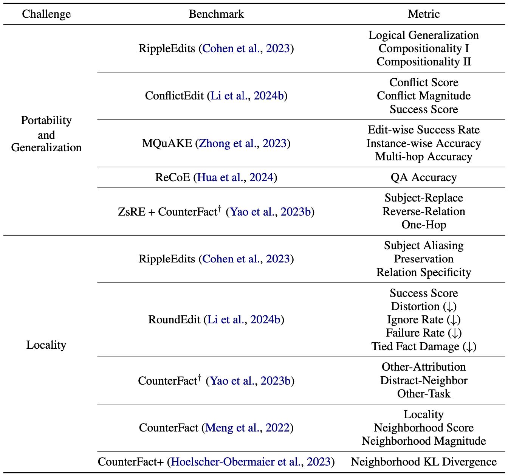

# Editing the Mind of Giants: An In-Depth Exploration of Pitfalls of Knowledge Editing in Large Language Models
- [arXiv Paper]()

<!-- Reference: https://github.com/jonschlinkert/markdown-toc -->

## Table of Content

<!-- toc -->

- [Overview of Knowledgge Editing](#overview-of-knowledgge-editing)
  * [Problem Definition](#problem-definition)
    + [Reliability](#reliability)
    + [Generalization](#generalization)
    + [Locality](#locality)
  * [Current Methods](#current-methods)
    + [Parameter-Modifying](#parameter-modifying)
    + [Parameter-Preserving](#parameter-preserving)
- [Challenges of Knowledge Editing](#challenges-of-knowledge-editing)
  * [Inability to Logically Inference and Robustly Generalize](#inability-to-logically-inference-and-robustly-generalize)
  * [Unintended Alteration of Non-Target Knowledge](#unintended-alteration-of-non-target-knowledge)
  * [Deterioration of General Abilities](#deterioration-of-general-abilities)
- [Discussion](#discussion)
- [Future Prospect](#future-prospect)
  * [Leveraging Information Retrieval and External Memory](#leveraging-information-retrieval-and-external-memory)
  * [Improve Understandings of LLMs' Internal Knowledge Structures](#improve-understandings-of-llms-internal-knowledge-structures)
  * [Improve Robustness of Knowledge Editing](#improve-robustness-of-knowledge-editing)

<!-- tocstop -->

## Overview of Knowledgge Editing

### Problem Definition
We denote the input and output space as $\mathbb{X}$ and $\mathbb{Y}$, respectively. The function space $\mathbb{F}: \mathbb{X} \rightarrow \mathbb{Y}$ is estimated by the base model $f_{\theta_0}$ parameterized by $\theta_0 \in \Theta$. Finally, let $Z_e = \{ (x_e, y_e) \ | \ f_{\theta_0}(x_e) \neq y_e \}$ be the set of edit queries we would like to apply to the base model.
% The goal of knowledge editing is to efficiently update the model to the edited model $f_{\theta_e}$ satisfying:
The goal of knowledge editing is to efficiently derive the edited model $f_{\theta_e}$ from the base model that satisfies the following:
```math
f_{\theta_e}(x_e) = y_e, \forall (x_e, y_e) \in Z_e
```

As shown in the figure below, the ideal edited model $f_{\theta_e}$ should satisfy three properties: **reliability**, **generalization**, and **locality**.
<p align="center">
    
</p>

#### Reliability
Given an edit query $(x_e, y_e)$, the edited model $f_{\theta_e}$ should output the target answer $y_e$ when given the target input $x_e$, i.e. $f_{\theta_e}(x_e) = y_e$. The reliability of an editing method is measured by calculating the average edit success rate:
```math
\mathbb{E}_{(x_e', y_e')\sim Z_e} \mathbb{1}\{ f_{\theta_e}(x_e') = y_e' \}
```

#### Generalization
The edited model should generalize the edited knowledge to relevant instances. The generalization metric is commonly formulated as the average success rate on the neighboring set:
```math
\mathbb{E}_{(x_e', y_e')\sim N(x_e, y_e)} \mathbb{1} \{ f_{\theta_e}(x_e') = y_e' \},
```
where $N(x_e, y_e)$ is the set of neighboring instances of an edit query $(x_e, y_e)$. Earlier works evaluate this metric by rephrasing the input prompts.

#### Locality
The editing process should not affect instances unrelated to the edit queries. The locality set of an edit query $(x_e, y_e)$ can be defined as $L(x_e) = \{ (x_{loc}, y_{loc}) \in \mathbb{X} \times \mathbb{Y}\ \mathrm{s.t}\ x_{loc} \notin N(x_e, y_e) \land f_{\theta_0}(x_{loc}) = y_{loc} \}$. The locality, also known as specificity, of a editing method is measured by calculating the level of invariance of model output before and after the edits, which can be calculated as follows:
```math
\mathbb{E}_{(x_{loc}, y_{loc})\sim L(x_e)} \mathbb{1} \{ f_{\theta_e}(x_{loc}) = y_{loc} \}
```
### Current Methods
We categorized current methods into parameter-modifying and parameter-preserving editing methods, each containing several strategies. An overview and illustration of current methods are included in the figure below.

<p align="center">
    
</p>

#### Parameter-Modifying
This category of methods, including meta-learning methods and locate-and-edit strategies, update LLMs' knowledge by modifying their parameters.

- **Meta-learning:**</br>
    Methods within the meta-learning class utilize a hyper-network that is trained to predict the updated network parameters. This strategy includes [KnowledgeEditor](https://arxiv.org/abs/2104.08164), [MEND(https://arxiv.org/abs/2110.11309)], and [MALMEN](https://openreview.net/forum?id=L6L1CJQ2PE).
- **Locate and Edit:**</br>
    Methods that use the other strategy, namely locate-and-edit, first identify the locations of knowledge within LLMs and edit those areas by updating corresponding parameters. This strategy includes [Knowledge Neuron](https://arxiv.org/abs/2104.08696), [ROME](https://rome.baulab.info/), [MEMIT](https://memit.baulab.info/), [PMET](https://arxiv.org/abs/2308.08742), and [EMMET](https://arxiv.org/abs/2403.14236).

#### Parameter-Preserving
In contrast to the previous category, parameter-preserving methods alter LLMs' output by adding new parameters, integrating external memory, or employing strategies like in-context learning and devising decoding strategies while keeping the pre-trained LLM unchanged.

- **Additional Parameters:**</br>
    Some methods utilize additional parameters, such as adding new neurons or employing parameter-efficient techniques. Such methods include [CaliNET](https://arxiv.org/abs/2210.03329), [T-Patcher](https://arxiv.org/abs/2301.09785), [GRACE](https://arxiv.org/abs/2211.11031), and [MELO](https://arxiv.org/abs/2312.11795).
- **External Memory:**</br>
    This class of methods utilize external memories for editing, which includes [SERAC](https://arxiv.org/abs/2206.06520) and [MeLLo](https://arxiv.org/abs/2305.14795).
- **In-Context Learning and Decoding:**</br>
    Certain strategies require no additional parameters, which includes [IKE](https://arxiv.org/abs/2305.12740) and [DeepEdit](https://arxiv.org/abs/2401.10471).

## Challenges of Knowledge Editing

Knowledge editing methods have been widely researched, yet there is a lack of comprehensive study on the challenges related to knowledge editing. In this section, we discuss the pitfalls of knowledge editing from three perspectives: low portability and generalization, low locality, and catastrophic forgetting. We organized the benchmarks related to the first two into the table below.

<p align="center">
    
</p>

### Inability to Logically Inference and Robustly Generalize
When updating a fact, it is essential not only to revise the specific knowledge but also to assess the impact on the related reasoning chain. The concept of portability has been introduced to evaluate the consequences of an edit and the robustness of generalization. Metrics such as **Subject Replace**, **Reversed Relation**, and **One Hop** are used to measure the generalization ability of editing methods in handling similar subjects, identical relations, and derivations. Additionally, **Logical Generalization** and **Compositionality** examine whether edited knowledge can be inferred in composite relations. Further studies assess the reasoning ability of edited models across various schemes using complex question-answering datasets and multi-hop questions. To address confusion from simultaneous edits of logically related facts, the **ConflictEdit** benchmark is proposed to evaluate methods handling conflicting edits.

### Unintended Alteration of Non-Target Knowledge
Locality is typically assessed using the locality dataset to evaluate edits on unrelated facts, but current approaches do not adequately reflect post-edit effects beyond this scope. Even with popular metrics like **Neighborhood Score** and **Neighborhood Magnitude**, edited models may still exhibit unintended alterations. For instance, while the ROME algorithm may successfully change the Louvre's location from Paris to London, the model might still incorrectly associate London-related terms with the Louvre. To address these issues, new benchmarks like CounterFact+ and metrics such as **Neighborhood KL Divergence** have been developed to uncover implicit side effects. Further studies explore facets of locality like **Other Relations**, **Distract Neighborhood**, and **Other Tasks** to evaluate attribute retention, input divergence, and post-edit performance on other tasks. Unintended edits may result from a single edit implicitly altering the predictive distribution of related objects. After multiple edits, these alterations can accumulate, distorting stored knowledge. To evaluate this, **Knowledge Distortion** is proposed. Knowledge distortion measures JS divergence of the object set distribution before and after editing, and extended to metrics like **Ignore Rate** and **Failure Rate** to assess neglect of non-target objects.

### Deterioration of General Abilities
In sequential editing scenarios, models often face issues like gradual forgetting and catastrophic forgetting, with meta-learning-based methods being more prone to knowledge loss than located-then-edit methods. Perplexity has been proposed as an alternative metric to indicate model collapse due to its correlation with downstream performance. It consistently increases across all parameter-modified methods and different LLMs in sequential editing scenarios. Additionally, post-edited models show a decline in performance across various downstream NLP tasks, indicating that parameter modification through model editing negatively impacts the general capabilities of LLMs.

## Discussion
> Please refer to our survey paper for more detailed explanation on experimental setup and results

Current editing methodologies often underperform in robust generalization and locality. IKE, which uses prompt demonstrations, excels in single edit conditions but struggles with multiple edits, indicating confusion when editing multiple related facts. Fine-tuning and meta-learning-based methods handle multiple related edits better. For locality, IKE remains stable in single edit settings, while parameter-modifying methods excel in Other Attribution but decline in other metrics, except for MEMIT, which stays stable. In multiple edit scenarios, SERAC shows low success and distortion rates due to its difficulty in recovering edited facts. The number of edits affects methods differently: meta-learning methods like MEND degrade significantly after 10-20 edits, locate-and-edit methods like ROME and KN after 10 edits, while MEMIT remains stable after 40 edits due to its multi-layer adjustment strategy. GRACE and SERAC, which store edited facts with additional parameters or use external memory, show no change in downstream task performance after edits. Overall, parameter-modifying methods degrade downstream task performance, while parameter-preserving methods maintain stable performance even after multiple edits.

## Future Prospects

### Leveraging Information Retrieval and External Memory
Research has shown that using external knowledge bases rather than relying solely on internal knowledge can help guide Large Language Models (LLMs) in generating content based on predefined facts. This approach effectively separates the factual knowledge from the inference processes, reducing potential biases in the models. External knowledge bases can include extensive text corpora, structured tables, or simple key-value databases. These sources can be used by either fine-tuning the LLMs to improve their information retrieval or by employing prompting and in-context learning techniques to query these sources without altering the model parameters. This method eliminates the need to verify and edit false information within the LLMs and allows for the use of attribution and reflection methods, ensuring that generated content aligns with the external knowledge base, thereby enhancing both accuracy and accountability.

### Improve Understandings of LLMs' Internal Knowledge Structures
While identifying factual knowledge storage in LLMs has been extensively studied, the correlation between knowledge location and model editing success is low. Although factual knowledge is strongly linked to feed-forward network layers, updates to multi-head self-attention layers also yield improved outcomes. This suggests that simply locating fact storage does not fully explain knowledge structures in LLMs. Further research into how knowledge locations interact with model predictions is crucial for enhancing LLM interpretability and controllability. Additionally, preserving LLMs' general capabilities is vital for assessing model editing efficacy. Recent breakthroughs in identifying regions related to general linguistic abilities have opened new research directions. Targeted modifications can be performed while avoiding alterations in these critical areas, preventing the deterioration of general abilities. This approach ensures that edits do not compromise overall LLM performance, significantly improving the specificity and effectiveness of current model editing methods.

### Improve Robustness of Knowledge Editing
Even after a successful edit, a revised model may reject the modification during extended dialogues, reverting to the pre-edit version (reversion) or providing an ambiguous answer (confusion). Experiments show that the more popular the knowledge in the benchmark, the easier it is for the modified model to revert to the original concept, highlighting the limited robustness of current editing strategies. A deeper understanding of how LLMs store and process different knowledge entities is crucial for more robust editing. There is also a lack of specific benchmarks and automated metrics addressing these issues. Knowledge-focused editing does not avoid hallucinations inherited from the pre-edit model. TruthX attempts to reduce hallucination by using a parameter-preserved approach, mapping the LLM's internal representation to semantic and truthful spaces and editing the truthfulness in that space. Combining truthfulness and knowledge adjustment in the same space may offer a practical solution.