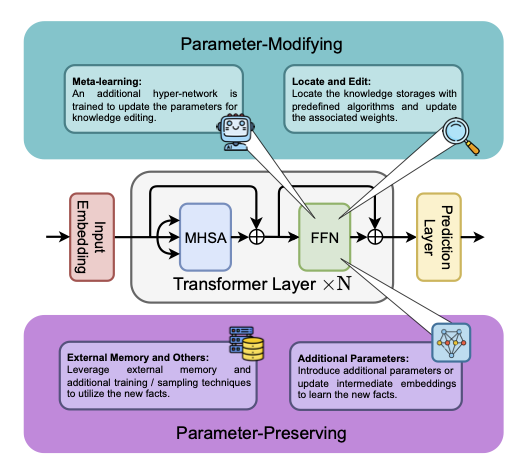

# Editing the Mind of Giants: An In-Depth Exploration of Pitfalls of Knowledge Editing in Large Language Models


<!-- Reference: https://github.com/jonschlinkert/markdown-toc -->

## Table of Content

<!-- toc -->

- [Overview of Knowledgge Editing](#overview-of-knowledgge-editing)
  * [Problem Definition](#problem-definition)
    + [Reliability](#reliability)
    + [Generalization](#generalization)
    + [Locality](#locality)

<!-- tocstop -->

## Overview of Knowledgge Editing

### Problem Definition
We denote the input and output space as $\mathbb{X}$ and $\mathbb{Y}$, respectively. The function space $\mathbb{F}: \mathbb{X} \rightarrow \mathbb{Y}$ is estimated by the base model $f_{\theta_0}$ parameterized by $\theta_0 \in \Theta$. Finally, let $Z_e = \{ (x_e, y_e) \ | \ f_{\theta_0}(x_e) \neq y_e \}$ be the set of edit queries we would like to apply to the base model.
% The goal of knowledge editing is to efficiently update the model to the edited model $f_{\theta_e}$ satisfying:
The goal of knowledge editing is to efficiently derive the edited model $f_{\theta_e}$ from the base model that satisfies the following:
```math
f_{\theta_e}(x_e) = y_e, \forall (x_e, y_e) \in Z_e
```

As shown in the figure below, the ideal edited model $f_{\theta_e}$ should satisfy three properties: **reliability**, **generalization**, and **locality**.
<p align="center">
    
</p>

#### Reliability
Given an edit query $(x_e, y_e)$, the edited model $f_{\theta_e}$ should output the target answer $y_e$ when given the target input $x_e$, i.e. $f_{\theta_e}(x_e) = y_e$. The reliability of an editing method is measured by calculating the average edit success rate:
```math
\mathbb{E}_{(x_e', y_e')\sim Z_e} \mathbb{1}\{ f_{\theta_e}(x_e') = y_e' \}
```

#### Generalization
The edited model should generalize the edited knowledge to relevant instances. The generalization metric is commonly formulated as the average success rate on the neighboring set:
```math
\mathbb{E}_{(x_e', y_e')\sim N(x_e, y_e)} \mathbb{1} \{ f_{\theta_e}(x_e') = y_e' \},
```
where $N(x_e, y_e)$ is the set of neighboring instances of an edit query $(x_e, y_e)$. Earlier works evaluate this metric by rephrasing the input prompts.

#### Locality
The editing process should not affect instances unrelated to the edit queries. The locality set of an edit query $(x_e, y_e)$ can be defined as $L(x_e) = \{ (x_{loc}, y_{loc}) \in \mathbb{X} \times \mathbb{Y}\ \mathrm{s.t}\ x_{loc} \notin N(x_e, y_e) \land f_{\theta_0}(x_{loc}) = y_{loc} \}$. The locality, also known as specificity, of a editing method is measured by calculating the level of invariance of model output before and after the edits, which can be calculated as follows:
```math
\mathbb{E}_{(x_{loc}, y_{loc})\sim L(x_e)} \mathbb{1} \{ f_{\theta_e}(x_{loc}) = y_{loc} \}
```
### Current Methods
We categorized current methods into parameter-modifying and parameter-preserving editing methods, each containing several strategies. An overview and illustration of current methods are included in the figure below.

<p align="center">
    
</p>

#### Parameter-Modifying
This category of methods, including meta-learning methods and locate-and-edit strategies, update LLMs' knowledge by modifying their parameters.

- Meta-learning:</br>
    Methods within the meta-learning class utilize a hyper-network that is trained to predict the updated network parameters. This strategy includes [KnowledgeEditor](https://arxiv.org/abs/2104.08164), [MEND(https://arxiv.org/abs/2110.11309)], and [MALMEN](https://openreview.net/forum?id=L6L1CJQ2PE).
- Locate and Edit:</br>
    Methods that use the other strategy, namely locate-and-edit, first identify the locations of knowledge within LLMs and edit those areas by updating corresponding parameters. This strategy includes [Knowledge Neuron](https://arxiv.org/abs/2104.08696), [ROME](https://rome.baulab.info/), [MEMIT](https://memit.baulab.info/), [PMET](https://arxiv.org/abs/2308.08742), and [EMMET](https://arxiv.org/abs/2403.14236).

#### Parameter-Preserving
In contrast to the previous category, parameter-preserving methods alter LLMs' output by adding new parameters, integrating external memory, or employing strategies like in-context learning and devising decoding strategies while keeping the pre-trained LLM unchanged.

- Additional Parameters:</br>
    Some methods utilize additional parameters, such as adding new neurons or employing parameter-efficient techniques. Such methods include [CaliNET](https://arxiv.org/abs/2210.03329), [T-Patcher](https://arxiv.org/abs/2301.09785), [GRACE](https://arxiv.org/abs/2211.11031), and [MELO](https://arxiv.org/abs/2312.11795).
- External Memory:</br>
    This class of methods utilize external memories for editing, which includes [SERAC](https://arxiv.org/abs/2206.06520) and [MeLLo](https://arxiv.org/abs/2305.14795).
- In-Context Learning and Decoding:</br>
    Certain strategies require no additional parameters, which includes [IKE](https://arxiv.org/abs/2305.12740) and [DeepEdit](https://arxiv.org/abs/2401.10471).

